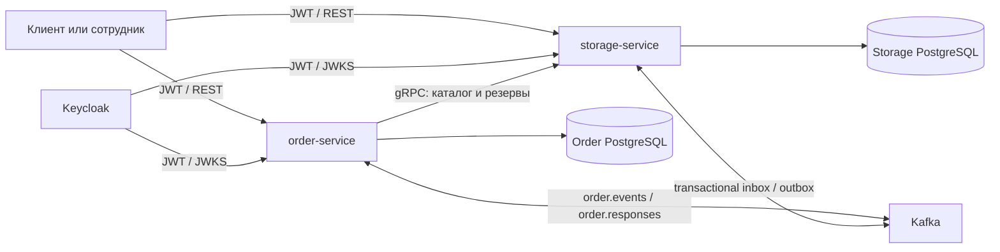

# DealershipAPI

[](https://github.com/ssivitskii/dealership-api/actions/workflows/ci.yml)

Backend автосалона на Java с двумя Spring Boot сервисами для каталога, склада, тест-драйвов и заказов автомобилей.

## Возможности

- каталог автомобилей с фильтрами и отдельным списком для тест-драйва;
- конфигуратор с проверкой совместимости вариантов комплектации;
- заказы на автомобили в наличии и на сборку, оформленные через модели состояний;
- атомарное резервирование автомобиля в наличии с TTL, подтверждением при оплате и восстановлением после сбоев;
- складской учёт автомобилей и запчастей;
- JWT-аутентификация через Keycloak и разграничение доступа по ролям;
- синхронное взаимодействие сервисов по gRPC и обмен событиями через Kafka;
- transactional inbox/outbox в обоих сервисах, повторная доставка и dead-letter topics;
- миграции и демонстрационные данные через Liquibase;
- unit- и integration-тесты на JUnit 5 и Testcontainers.

## Архитектура

| Модуль | Назначение |
| --- | --- |
| `order-service` | Заказы, заявки на тест-драйв, REST-прокси каталога через gRPC, отправка и обработка событий заказов |
| `storage-service` | Каталог, конфигуратор, склад, заказы на сборку, gRPC-сервер и обработка событий |
| `common` | Общие Kafka-события и protobuf/gRPC-контракт |



Внутри сервисов доменная модель и прикладные сервисы отделены от REST, persistence, messaging и security-адаптеров. У каждого сервиса своя PostgreSQL-база. `order-service` записывает событие заказа в outbox, планировщик отправляет его в `order.events`, а `storage-service` атомарно фиксирует inbox, складской заказ и ответный outbox. Ответ из `order.responses` также применяется вместе с inbox в одной транзакции БД заказов.

Каждое новое Kafka-сообщение имеет envelope версии 1: `eventId`, `eventType`, `version`, `aggregateId`, `traceId` и объект `payload`. ID равен UUID строки outbox и остаётся тем же при каждом повторе. Consumers проверяют версию, тип, обязательные поля и совпадение Kafka key с `aggregateId` и `payload.orderId`. Старые JSON-события без envelope всё ещё принимаются; для них вычисляется стабильный UUID из topic, типа и ID заказа.

Publisher берёт короткую lease в PostgreSQL, освобождает транзакцию и только затем ждёт подтверждение Kafka. Строка помечается отправленной лишь после broker ACK; timeout или ошибка оставляют её для повтора с backoff 1–60 секунд. Более позднее событие того же aggregate ждёт более раннее. Kafka producer использует `acks=all` и idempotence, но общая гарантия остаётся **at least once**: дубликаты отсекает transactional inbox, а не распределённая транзакция с брокером.

Permanent-ошибки контракта сразу, а временные ошибки после трёх попыток, публикуются в `<source-topic>.DLT` с исходными key/value и диагностическими headers. Source offset фиксируется только после успешного ACK от DLT. DLT автоматически не проигрывается: сначала устраните причину, затем повторно отправьте исходное сообщение с тем же key и `eventId`, чтобы сохранить идемпотентность.

Для заказа автомобиля в наличии `order-service` сначала получает временный резерв с TTL и затем в одной локальной транзакции сохраняет заказ и workflow. Ledger в БД склада сериализует операции по ID заказа, а условный `UPDATE` автомобиля гарантирует одного владельца. Повтор того же reserve возвращает первоначальный deadline и не продлевает TTL. При переходе из `AWAITING_PAYMENT` резерв подтверждается и перестаёт истекать; только после этого заказ становится `PAID` и создаёт outbox-событие.

Confirm и release сохраняются как durable intent в `stock_reservation_workflows`. Фоновый worker повторяет незавершённые операции после перезапуска. Отмена сначала фиксирует `CANCELLED` и `RELEASE_PENDING`, затем вызывает склад. Owner-checked release и terminal tombstone защищают новую бронь от запоздалых запросов старого заказа. Отдельный worker склада освобождает неподтверждённые резервы по времени PostgreSQL; локальный worker заказа отменяет соответствующий неоплаченный заказ.

По умолчанию hold живёт `PT15M`, оба recovery worker запускаются каждые `PT10S` и обрабатывают до 100 записей. Неуспешные intents получают backoff от 1 до 60 секунд, чтобы одна проблемная запись не блокировала очередь. Параметры задаются через `reservation.hold-ttl`, `reservation.recovery.interval` и `reservation.recovery.batch-size`.

При создании stock-заказа несуществующий автомобиль возвращает `404`, недоступный или уже зарезервированный — `409`, некорректный UUID — `400`, а недоступность склада — `503`. Для отмены `503` означает, что `CANCELLED` уже зафиксирован, а durable worker продолжит owner-checked release. Отмена временно отклоняется, пока выполняется подтверждение резерва, чтобы concurrent confirm и cancel не расходились.

При создании custom-заказа `order-service` синхронно получает у склада каноническую конфигурацию и рассчитанную цену, а затем сохраняет этот snapshot. Клиент обязан передать ровно по одному совместимому варианту для каждой категории модели. Старое поле `totalPrice` в REST-запросе оставлено только для совместимости и полностью игнорируется: подмена цены клиентом не влияет на заказ. Некорректные UUID и неполный/лишний набор категорий дают `400`, отсутствующая модель или компонент — `404`, несовместимый вариант — `409`, недоступный или некорректно ответивший склад — `503`.

Оплата реализована только как управляемый вызывающей стороной **demo workflow simulator**. Он не принимает реквизиты карты или счёта, не списывает деньги, не обращается к платёжному провайдеру и не утверждает, что сумма реально оплачена. Клиент передаёт `SUCCESS` или `DECLINE`; durable receipt сохраняет выбранный исход и состояние workflow. Для каждого POST обязателен UUID-заголовок `Idempotency-Key`. Повтор того же ключа и исхода возвращает тот же receipt даже после последующего изменения заказа, а смена исхода для ключа возвращает `409`. `DECLINED` оставляет заказ в `AWAITING_PAYMENT` и разрешает новую попытку с новым ключом. Новый ключ отклоняется, пока есть `PENDING` или `SUCCEEDED`.

Stock-заказ с `SUCCESS` сначала атомарно сохраняет `PENDING` и intent подтверждения резерва, затем вызывает склад без открытой транзакции БД. Временная ошибка оставляет receipt в `PENDING`: POST/GET возвращает `202`, а worker повторяет intent. Успешное подтверждение атомарно фиксирует `SUCCEEDED`, `PAID` и одно outbox-событие; terminal-ошибка резерва фиксирует `FAILED` и отменяет заказ. Custom-заказ фиксирует `SUCCEEDED`, `PAID` и outbox в одной локальной транзакции. Terminal receipts возвращаются с `200`. Существующая отмена уже оплаченного в demo заказе сохраняет `SUCCEEDED` как исторический исход; simulator не моделирует возврат средств или refund accounting.

Запись на тест-драйв создаётся на фиксированный часовой интервал `[scheduledAt, scheduledAt + 1 час)`. Поэтому соседняя запись ровно с момента окончания разрешена, а любое пересечение для того же автомобиля возвращает `409`; это правило атомарно обеспечивает PostgreSQL и для конкурентных запросов. Время должно быть строго в будущем в бизнес-часовом поясе `Europe/Moscow` (настраивается через `business.time-zone`). При записи сервис проверяет, что автомобиль сейчас доступен и разрешён для тест-драйва. Это проверка в момент бронирования, а не распределённая будущая блокировка автомобиля от последующей продажи или складской операции.

Клиент получает только собственные записи через `GET /api/test-drives/mine` и может отменить свою активную заявку через `POST /api/test-drives/{id}/cancel`; менеджер или администратор может отменить любую активную заявку. Одобрение через `POST /api/test-drives/{id}/approve` разрешено менеджеру или администратору только до начала слота, а завершение через `POST /api/test-drives/{id}/complete` — не раньше его конца. Допустимы переходы `PENDING → APPROVED → COMPLETED` и отмена из `PENDING` или `APPROVED`; повтор уже выполненного перехода идемпотентен, остальные переходы возвращают `409`. Отмена сразу освобождает часовой слот для новой записи.

Основной стек: Java 21, Spring Boot 3.3, Spring Security/OAuth2 Resource Server, Spring Data JPA, PostgreSQL 16, Liquibase, Kafka, gRPC/Protobuf, Keycloak, Gradle 8.12, JUnit 5 и Testcontainers.

## Запуск локально

Для полного запуска одной командой нужны Docker с Docker Compose и свободные порты из таблицы ниже. JDK 21 требуется только для нативного запуска через Gradle; устанавливать сам Gradle отдельно не нужно, wrapper включён в проект.

Поднимите весь проект одной командой:

```bash
docker compose up --build --wait
```

Compose собирает оба приложения, запускает PostgreSQL, Keycloak, ZooKeeper и Kafka, ждёт health checks и затем поднимает сервисы. Состояние можно посмотреть командой `docker compose ps`, логи — `docker compose logs -f`.

После первого запуска пройдите [пятиминутный demo-сценарий](docs/demo.md): в нём есть готовые команды для тест-драйва, заказа автомобиля и идемпотентной demo-оплаты.

Остановка с удалением локальных данных:

```bash
docker compose down --volumes
```

Для разработки через `bootRun` можно поднять только инфраструктуру:

```bash
docker compose up -d order-db storage-db keycloak-db keycloak zookeeper kafka
./gradlew :storage-service:bootRun # отдельный терминал
./gradlew :order-service:bootRun   # отдельный терминал
```

| Компонент | Адрес/порт |
| --- | --- |
| `order-service` | `http://localhost:8081` |
| `storage-service` | `http://localhost:8082` |
| Keycloak | `http://localhost:8180` |
| Kafka | `localhost:9092` |
| Order PostgreSQL | `localhost:5433` |
| Storage PostgreSQL | `localhost:5434` |

Swagger UI доступен по адресам:

- `http://localhost:8081/swagger-ui.html`
- `http://localhost:8082/swagger-ui.html`

В Compose внутренний gRPC доступен только `order-service` по адресу `storage-service:9090` и не публикуется на host. HTTP и инфраструктурные порты привязаны к `127.0.0.1`.

При нативном запуске Storage gRPC по умолчанию слушает только `127.0.0.1`. Внутри Compose он слушает контейнерную сеть. Эта сеть и Kafka являются доверенной demo-границей; перед внешним развёртыванием им нужны TLS, аутентификация сервисов и ACL.

Обновление с версии без reservation ledger, reliable messaging, demo payment или проверки пересечений тест-драйва нужно выполнять с согласованной остановкой и последующим запуском обоих сервисов. Перед добавлением уникального business key проверьте историю склада запросом `SELECT source_order_id, count(*) FROM assembly_orders GROUP BY source_order_id HAVING count(*) > 1;`: миграция намеренно остановится при дублях и не удаляет данные автоматически. `source_order_id` после обновления считается неизменяемым, повторное использование ID после soft delete не поддерживается. Смешанная работа старых и новых версий небезопасна. В частности, старый `order-service` ещё умеет обходить receipt обычным переходом из `AWAITING_PAYMENT`, поэтому все его узлы нужно остановить до применения миграции `006` и запустить вместе на новой версии. Миграция reservation помечает прежние неоплаченные заказы как `LEGACY_UNVERIFIED` и проверяет их резерв при попытке demo payment; оплаченные заказы сохраняются как подтверждённые без ретроактивного TTL. Старый `CONFIRM_PENDING` без receipt продолжает восстанавливаться worker-ом, но новый payment-запрос для него получает `409` и не создаёт синтетический receipt.

Перед миграцией ограничения test-drive сначала найдите активные строки с невалидным UUID автомобиля:

```sql
SELECT id, car_id
FROM test_drive_requests
WHERE removed = false
  AND status IN ('PENDING', 'APPROVED')
  AND NOT pg_input_is_valid(car_id, 'uuid');
```

После исправления таких строк проверьте пересечения. Сравнение через `uuid` специально считает разные регистры и другие допустимые текстовые представления одним автомобилем:

```sql
WITH valid AS MATERIALIZED (
    SELECT *
    FROM test_drive_requests
    WHERE removed = false
      AND status IN ('PENDING', 'APPROVED')
      AND pg_input_is_valid(car_id, 'uuid')
)
SELECT a.id AS first_id, b.id AS second_id, a.car_id
FROM valid a
JOIN valid b
  ON a.id < b.id
 AND a.car_id::uuid = b.car_id::uuid
 AND tsrange(a.requested_date_time,
             a.requested_date_time + interval '1 hour', '[)')
     &&
     tsrange(b.requested_date_time,
             b.requested_date_time + interval '1 hour', '[)');
```

Миграция не угадывает, какую историческую заявку удалить или перенести: при невалидном ID или пересечении она останавливается, сохраняя исходные данные для ручного решения.

## Демонстрационная авторизация

Realm `dealership` импортируется при первом запуске Keycloak. Все перечисленные учётные записи и пароль предназначены только для локальной демонстрации.

| Логин | Роль | Пароль |
| --- | --- | --- |
| `client1`, `client2` | `USER` | `password` |
| `manager1` | `MANAGER` | `password` |
| `warehouse1` | `WAREHOUSE_ADMIN` | `password` |
| `admin1` | `ADMIN` | `password` |

Пример получения токена и безопасного чтения каталога (нужны `curl` и `jq`):

```bash
ACCESS_TOKEN="$(curl --fail --silent --show-error \
  -X POST 'http://localhost:8180/realms/dealership/protocol/openid-connect/token' \
  -H 'Content-Type: application/x-www-form-urlencoded' \
  --data-urlencode 'client_id=dealership-app' \
  --data-urlencode 'grant_type=password' \
  --data-urlencode 'username=client1' \
  --data-urlencode 'password=password' | jq -r '.access_token')"

curl --fail --silent --show-error \
  -H "Authorization: Bearer ${ACCESS_TOKEN}" \
  'http://localhost:8082/api/cars/available'
```

## API

Полные схемы запросов и ответов находятся в Swagger. Основные группы маршрутов:

| Сервис | Маршруты | Доступ |
| --- | --- | --- |
| Order | `GET /api/v1/cars`, `GET /api/v1/cars/{id}` | `USER`, `MANAGER`, `ADMIN` |
| Order | `/api/orders/stock/**` | создание и отмена: `USER`/`ADMIN`; просмотр: `USER`/`MANAGER`/`ADMIN`; смена статуса: `MANAGER`/`ADMIN` |
| Order | `/api/orders/custom/**` | создание и отмена: `USER`/`ADMIN`; просмотр: `USER`/`MANAGER`/`ADMIN`; смена статуса: `MANAGER`/`WAREHOUSE_ADMIN`/`ADMIN` |
| Order | `POST /api/orders/{stock\|custom}/{orderId}/demo-payments` | `USER`/`ADMIN`, но JWT subject всегда должен быть владельцем заказа |
| Order | `GET /api/orders/{stock\|custom}/{orderId}/demo-payments/{paymentId}` | владелец; audit-read: `MANAGER`/`ADMIN` |
| Order | `/api/test-drives/**` | создание: `USER`/`ADMIN`; свои заявки и их отмена: `USER`; все заявки и смена статуса: `MANAGER`/`ADMIN` |
| Storage | `GET /api/cars/{id}`, `/api/cars/available`, `/api/cars/test-drive`, `/api/cars/search` | любой аутентифицированный пользователь |
| Storage | `/api/configuration/**` | любой аутентифицированный пользователь |
| Storage | `/api/inventory/cars/**` | `MANAGER`, `ADMIN` |
| Storage | `/api/inventory/parts/**` | чтение: `WAREHOUSE_ADMIN`/`MANAGER`/`ADMIN`; изменение: `WAREHOUSE_ADMIN`/`ADMIN` |
| Storage | `/api/assembly-orders/**` | `WAREHOUSE_ADMIN`, `ADMIN` |

После перевода заказа в `AWAITING_PAYMENT` demo-попытка выглядит так:

```bash
IDEMPOTENCY_KEY='90000000-0000-0000-0000-000000000001'

curl --fail-with-body \
  -X POST "http://localhost:8081/api/orders/stock/${ORDER_ID}/demo-payments" \
  -H "Authorization: Bearer ${ACCESS_TOKEN}" \
  -H "Idempotency-Key: ${IDEMPOTENCY_KEY}" \
  -H 'Content-Type: application/json' \
  -d '{"outcome":"SUCCESS"}'
```

Ответ содержит только workflow receipt (`id`, тип и ID заказа, ключ, выбранный исход, статус и безопасный `failureCode`). В нём намеренно нет суммы, платёжных реквизитов или утверждения о реальном списании.

## Сборка и тесты

```bash
./gradlew --no-daemon clean assemble
./gradlew --no-daemon test
./gradlew --no-daemon integrationTest
./gradlew --no-daemon :order-service:e2eTest
```

Задачи `integrationTest` и `e2eTest` требуют работающий Docker для Testcontainers и не включены автоматически в `build`. GitHub Actions выполняет обе вместе со сборкой и unit-тестами на JDK 21.

Интеграционные тесты проверяют конкурентность payment keys, receipt/outbox rollback, recovery после временной ошибки склада, гонку confirm/expiry, lifecycle и часовое исключение test-drive, UUID aliases на реальной PostgreSQL, lease/fencing outbox, atomic inbox и обработку poison-сообщения через реальный Kafka DLT. E2E-тест поднимает две PostgreSQL, Kafka и Keycloak, запускает `order-service` и `storage-service` отдельными JVM и проходит настоящий JWT HTTP → gRPC сценарий, включая серверную цену конфигурации, demo payments и lifecycle test-drive. Отдельный CI smoke запускает готовый Compose stack и проверяет те же HTTP/gRPC границы, Kafka-переход, повтор ответа, отмену и повторную бронь.

## Ограничения

Проект предназначен для обучения и демонстрации архитектурных подходов, а не для production-развёртывания. Локальная конфигурация содержит демонстрационные пароли, включая открытые значения в seed-данных таблицы пользователей. Compose привязывает host-порты к loopback, но внутренняя сеть сервисов остаётся доверенной и работает без TLS.

Общей транзакции между двумя PostgreSQL-базами и Kafka нет: API может вернуть временную ошибку, пока durable worker завершает confirm или release, а события могут приходить повторно. Сиротский reserve после аварии освобождается TTL склада. Проект не содержит операторской панели, метрик/alerts и автоматического безопасного replay для DLT; DLT и таблицы inbox/outbox нужно включить в эксплуатационный мониторинг.

Terminal ledger-записи, release tombstone, inbox, отправленные outbox-строки и DLT-сообщения сейчас сохраняются без автоматической очистки; для долгоживущей системы нужна согласованная retention-политика и архивирование. Откат версии также выполняется согласованно для обоих приложений и из совместимого backup обеих БД: простой запуск старого JAR после новых миграций не поддерживается.
